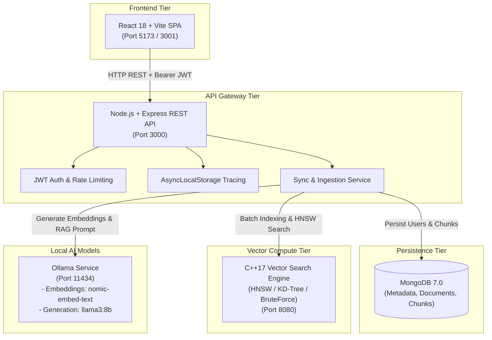

# My Own AI — Full-Stack RAG & Custom Vector Engine Monorepo

[](https://github.com/Shashank-ok/My-own-AI/actions/workflows/ci.yml)
[](https://en.cppreference.com/w/cpp/17)
[](https://nodejs.org/)
[](LICENSE)

An end-to-end, high-performance **Retrieval-Augmented Generation (RAG)** platform and **custom vector search engine** built from first principles.

Instead of wrapping third-party vector databases (such as Pinecone, Qdrant, or Chroma), this monorepo implements a bare-metal C++ vector engine supporting **HNSW (Hierarchical Navigable Small World)** graphs, **KD-Trees**, and **Brute-Force exact nearest-neighbor search**, orchestrated by a secure Node.js Express REST API Gateway and a modern React + TypeScript dashboard.

---

## 1. System Architecture

The architecture enforces strict single-responsibility boundaries. The React frontend interacts **exclusively** with the Node.js API Gateway, which handles authentication, tenant isolation, document chunking, MongoDB persistence, and downstream calls to Ollama and the C++ Vector Engine.



---

## 2. Architectural Rationale ("Why?")

### Why C++ for the Vector Engine?
- **Bare-Metal Performance**: Achieves sub-millisecond nearest-neighbor search latencies (**<0.2 ms** for 5,000 vectors) without garbage collection pauses.
- **Custom Index Algorithms**: Full low-level control over memory layouts, graph pointer traversal (`HNSW`), spatial splitting (`KD-Tree`), and distance metrics (Cosine, Euclidean, Manhattan).
- **SIMD Vectorization**: Direct memory alignment and compiler vectorization for floating-point array distance computations.

### Why Node.js for the API Gateway?
- **Asynchronous I/O Orchestration**: Ideal for coordinating non-blocking concurrent requests between client HTTP sessions, MongoDB operations, C++ Engine vector queries, and LLM text generation streams.
- **Security & Middleware Ecosystem**: Robust middleware pipeline for JWT authentication, bcrypt password hashing, Zod schema validation, Helmet security headers, CORS origin enforcement, and rate limiting.

### Why MongoDB for Metadata & Document Storage?
- **Durable Source of Truth**: Stores structured user profiles, raw documents, text chunk positions, and conversation histories.
- **Index Rebuild Fallback**: The C++ Engine keeps vector graphs in memory for maximum speed. If the C++ Engine restarts, Node.js uses MongoDB as the source of truth to automatically rebuild namespaces (`POST /api/admin/namespaces/:ns/rebuild`).

---

## 3. End-to-End RAG Workflow

```text
[ User Text Input ] ──► [ Sliding Window Chunker ] ──► [ Ollama Embeddings ]
                                                            │
┌───────────────────────────────────────────────────────────┘
▼
[ C++ HNSW Vector Index ] ◄── (K-NN Cosine Search) ◄── [ Query Vector ]
        │
        ▼ (Top-K Chunks)
[ MongoDB Source Text ] ──► [ RAG Context Builder ] ──► [ Ollama LLM (llama3:8b) ]
                                                                 │
                                                                 ▼
                                                        [ Synthesized Answer ]
```

1. **Document Ingestion**: Node.js receives raw text, splits it using a deterministic sliding-window chunker (`DEFAULT_CHUNK_SIZE=500`, `DEFAULT_CHUNK_OVERLAP=50`), and saves text chunks to MongoDB.
2. **Embedding Generation**: Node.js sends text chunks to Ollama (`nomic-embed-text`) to generate 768-dimensional vector embeddings.
3. **C++ Indexing**: Node.js batch-inserts vector embeddings into the C++ Engine under a server-derived user namespace (`user_<userId>`).
4. **Hybrid Search & RAG**: When a user asks a question, Node.js embeds the question, queries the C++ HNSW graph for nearest chunk IDs, retrieves source text from MongoDB, constructs a context-augmented prompt, and requests a completion from Ollama (`llama3:8b`).

---

## 4. Monorepo Structure

```text
.
├── engine/cpp/       # High-performance C++17 Vector Search Engine (httplib, HNSW, KD-Tree, GoogleTest)
├── apps/api/         # Node.js + Express + TypeScript REST API Gateway (Mongoose, Vitest, Zod)
├── apps/web/         # React 18 + Vite + TypeScript Frontend UI (Lucide Icons, Vitest)
├── benchmarks/       # Empirical benchmark results (benchmark_results.csv)
├── docker/           # Dockerfiles & container configurations
├── docs/             # Technical specifications & distributed observability guide (observability.md)
├── docker-compose.yml# Production-grade multi-container orchestration
└── package.json      # Monorepo root workspace configuration
```

---

## 5. Empirical Benchmarks (Actual Recorded Data)

The C++ Vector Engine includes an automated benchmarking utility (`benchmark.exe`). The following metrics reflect actual empirical execution results measured on standard hardware (extracted from [`benchmarks/benchmark_results.csv`](file:///c:/Users/shash/OneDrive/Documents/My%20own%20AI/Your-OWN-AI/benchmarks/benchmark_results.csv)):

| Dataset Size ($N$) | Dimensions | Metric | Algorithm | Mean Latency ($\mu\text{s}$) | QPS | Recall@10 | Build Time (ms) |
| :--- | :--- | :--- | :--- | :--- | :--- | :--- | :--- |
| **100** | 64D | Cosine | **HNSW** | **37.69 $\mu\text{s}$** | **26,161** | **100.0%** | 7.12 ms |
| 100 | 64D | Cosine | KDTree | 10.34 $\mu\text{s}$ | 93,292 | 100.0% | 0.05 ms |
| 100 | 64D | Cosine | BruteForce | 8.02 $\mu\text{s}$ | 122,070 | 100.0% | 0.03 ms |
| **1,000** | 64D | Cosine | **HNSW** | **115.30 $\mu\text{s}$** | **8,583** | **99.6%** | 166.00 ms |
| 1,000 | 64D | Cosine | KDTree | 40.40 $\mu\text{s}$ | 24,569 | 100.0% | 0.30 ms |
| 1,000 | 64D | Cosine | BruteForce | 61.94 $\mu\text{s}$ | 16,082 | 100.0% | 0.30 ms |
| **5,000** | 64D | Cosine | **HNSW** | **195.23 $\mu\text{s}$** | **5,108** | **90.8%** | 2,211.72 ms |
| 5,000 | 64D | Cosine | KDTree | 273.34 $\mu\text{s}$ | 3,652 | 100.0% | 1.69 ms |
| 5,000 | 64D | Cosine | BruteForce | 325.27 $\mu\text{s}$ | 3,068 | 100.0% | 0.83 ms |

> [!NOTE]
> As dataset size increases to 5,000+ vectors, HNSW logarithmic search scaling demonstrates superior latency (**195 $\mu\text{s}$**) compared to BruteForce (**325 $\mu\text{s}$**) and KDTree (**273 $\mu\text{s}$**).

---

## 6. Automated Test Suites (164 Passing Tests)

The monorepo features 164 passing automated tests across all tiers:

| Tier | Component | Test Runner | Total Tests |
| :--- | :--- | :--- | :--- |
| **Engine** | C++ Vector Engine | `CTest` / `GoogleTest` | **53 passed** |
| **Gateway** | Node.js REST API | `Vitest` | **111 passed** |
| **Total** | | | **164 passed** |

### Run C++ Engine Tests (53 Tests)
```powershell
cmake -S engine/cpp -B engine/cpp/build_test -G "MinGW Makefiles" -DCMAKE_BUILD_TYPE=Release
cmake --build engine/cpp/build_test
ctest --test-dir engine/cpp/build_test --output-on-failure
```

### Run Node.js API Tests (111 Tests)
```powershell
npm --prefix apps/api run test
```

---

## 7. Prerequisites & Environment Configuration

### Prerequisites
1. **C++17 Compiler**: MinGW-w64 GCC 13+ (Windows) or GCC/Clang (Linux/macOS) and **CMake 3.24+**
2. **Node.js**: v20+ and **npm**
3. **MongoDB**: MongoDB 7.0+ running on port `27017`
4. **Ollama**: Running locally on port `11434` with required models:
   ```bash
   ollama pull nomic-embed-text
   ollama pull llama3:8b
   ```

### Key Environment Variables (`apps/api/.env`)
```env
PORT=3000
NODE_ENV=development
MONGODB_URI=mongodb://localhost:27017/myownai
CPP_ENGINE_URL=http://localhost:8080
CPP_ENGINE_TIMEOUT_MS=10000
OLLAMA_URL=http://localhost:11434
OLLAMA_EMBEDDING_MODEL=nomic-embed-text
OLLAMA_GENERATE_MODEL=llama3:8b
DEFAULT_CHUNK_SIZE=500
DEFAULT_CHUNK_OVERLAP=50
JWT_SECRET=dev-secret-key-change-in-prod-12345
ALLOWED_ORIGINS=http://localhost:3000,http://localhost:5173,http://localhost:3001
```

---

## 8. Development & Build Commands

### Root Monorepo Setup & Workflow
```powershell
# 1. Install Node.js dependencies across apps
npm run setup

# 2. Build C++ Vector Engine
npm run build:engine

# 3. Start Node.js API Gateway (Port 3000)
npm run dev:api

# 4. Start React Web UI (Port 5173 / 3001)
npm run dev:web
```

### Manual CMake Build (C++ Engine)
```powershell
cmake -S engine/cpp -B engine/cpp/build -G "MinGW Makefiles" -DCMAKE_BUILD_TYPE=Release
cmake --build engine/cpp/build
.\engine\cpp\build\db.exe 8080
```

---

## 9. Docker Container Startup

The platform includes a multi-container Docker Compose configuration:

```bash
# Build and launch containers
docker compose up -d --build

# View service logs
docker compose logs -f api

# Shutdown containers
docker compose down
```

### Container Services
- **`web`**: Nginx static server hosting React SPA (Port `80`)
- **`api`**: Node.js Express Gateway running under unprivileged `node` user (Port `3000`)
- **`engine`**: C++ Vector Engine compiled via multi-stage Debian build (Port `8080`)
- **`mongodb`**: MongoDB 7.0 persistent database (Port `27017`)

---

## 10. API Documentation & Observability

- **Raw OpenAPI 3.0 Specification**: `GET /api/docs/openapi.json`
- **Interactive Swagger UI**: `GET /api/docs/`
- **Distributed Observability & Log Tracing**: See [docs/observability.md](file:///c:/Users/shash/OneDrive/Documents/My%20own%20AI/Your-OWN-AI/docs/observability.md) for full details on `X-Request-ID` propagation and structured JSON log correlation.

---

## 11. Security Considerations

1. **Authentication & Password Safety**: User passwords hashed using `bcryptjs` (salt factor 10). JWT tokens signed with server secrets.
2. **Server-Derived Tenant Isolation**: Vector namespaces are derived strictly on the server (`user_<userId>`) preventing cross-user data leakage.
3. **Production Sanitization**: Internal 500 server errors are sanitized in production (`NODE_ENV=production`) to prevent stack trace or database detail disclosure.
4. **Defensive Headers & Rate Limiting**: Express app configured with `helmet`, CORS origin verification, request size limits, and `express-rate-limit`.

---

## 12. Known Limitations & Future Roadmap

### Current Limitations
- **In-Memory C++ Index**: Vector index resides in RAM; dataset size is limited by host memory (backed by MongoDB persistence for recovery).
- **Single-Node Engine**: Designed for single-instance high-throughput execution; does not implement raft consensus sharding.

### Future Roadmap
- [ ] **DiskANN / IVFFlat**: Disk-backed vector indexing for multi-million scale datasets.
- [ ] **SIMD Intrinsic Optimizations**: Explicit AVX2 / AVX-512 intrinsic acceleration for distance function loops.
- [ ] **Server-Sent Events (SSE)**: Streaming token response delivery for RAG completions.

---

## License

MIT License — free to modify and use.
